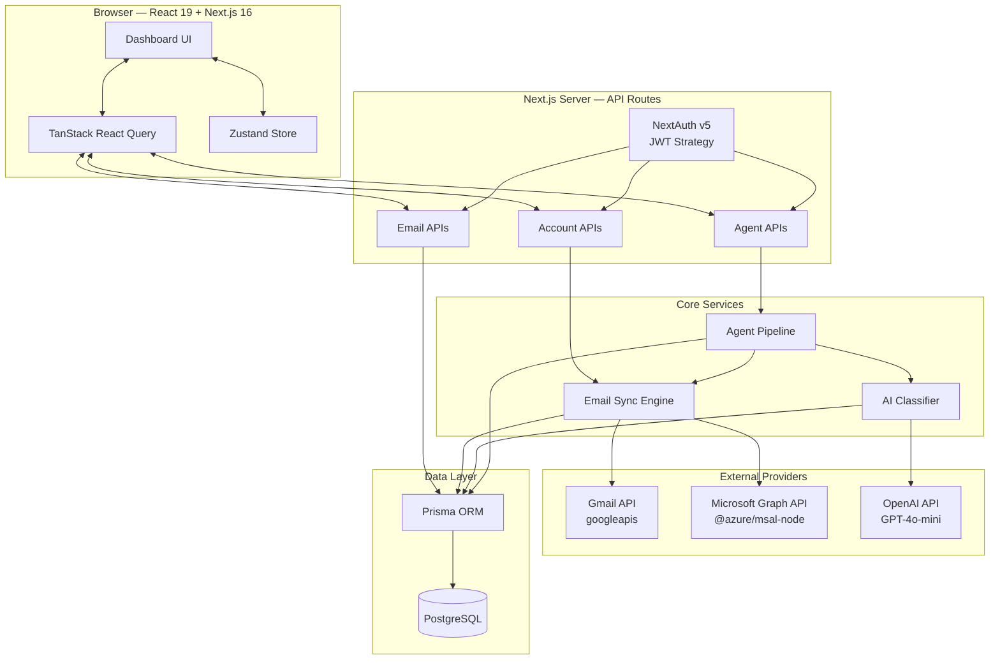
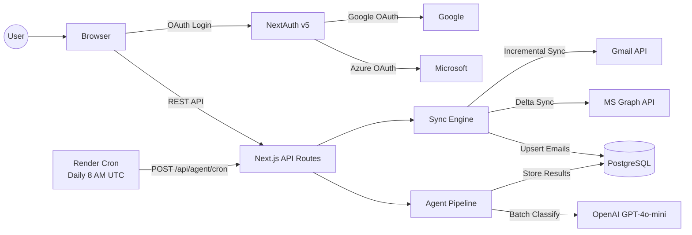
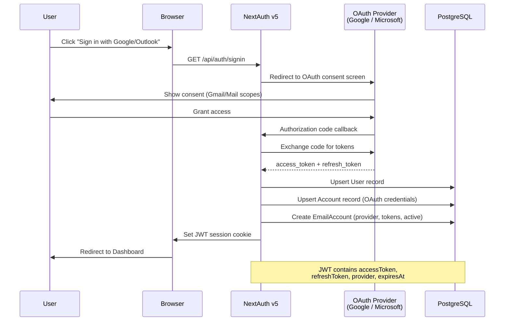
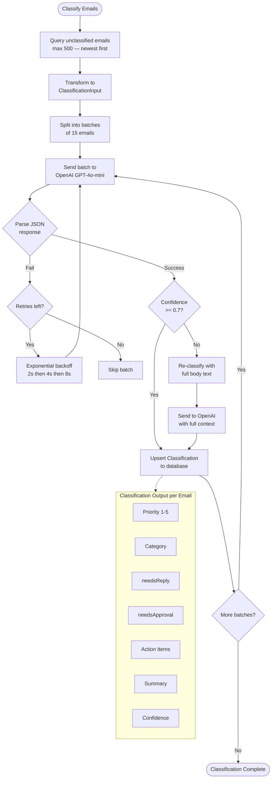
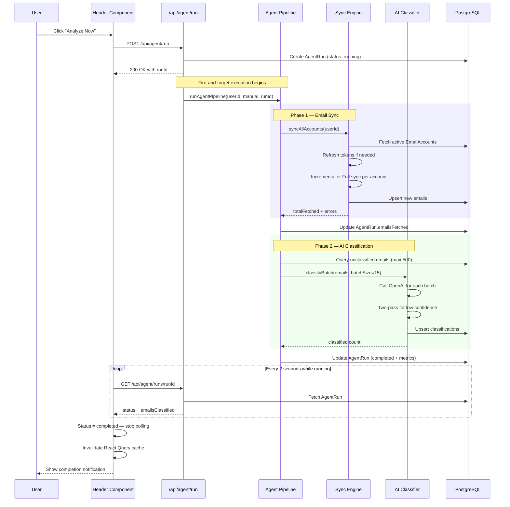
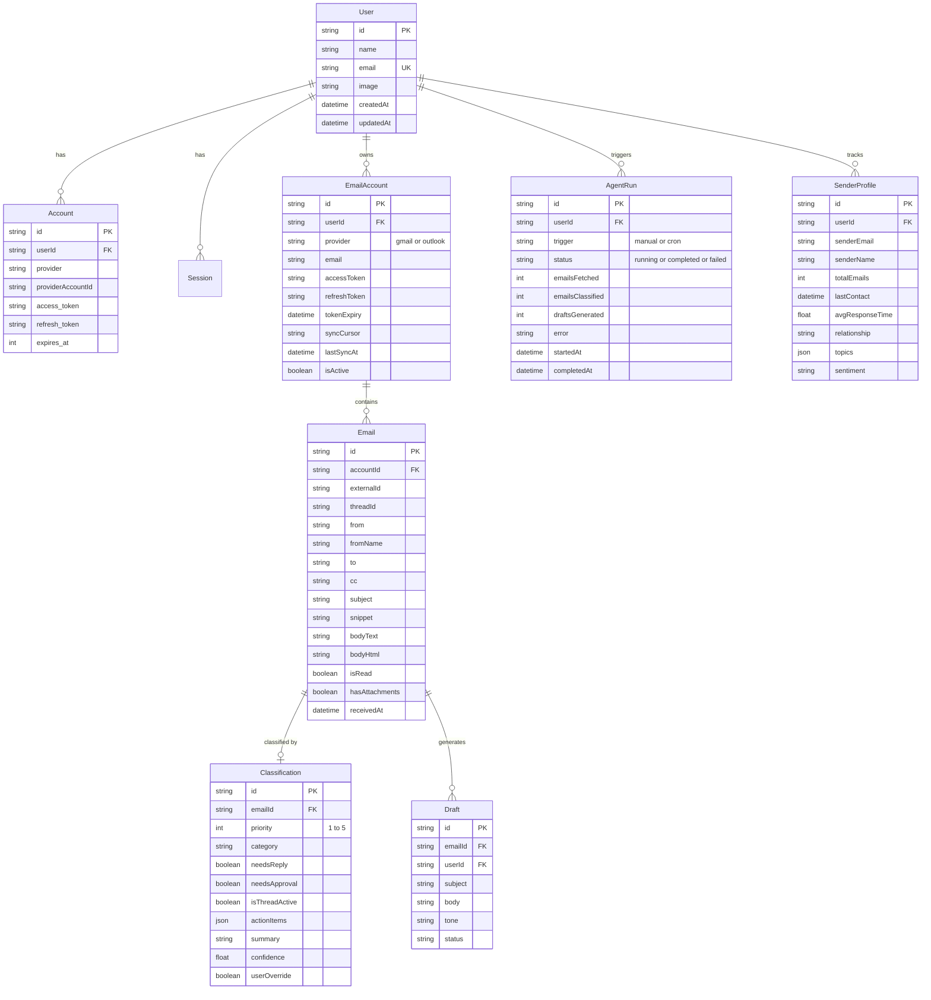
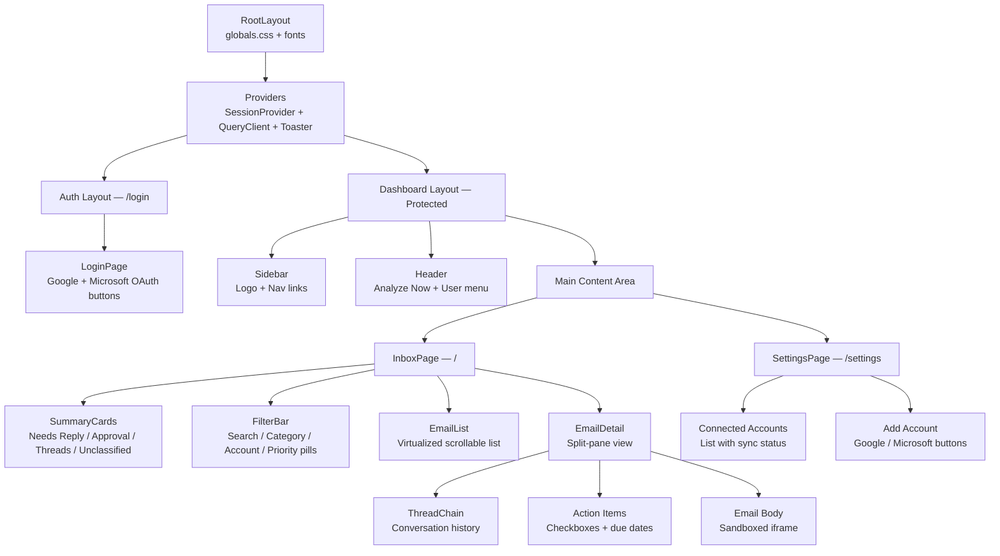
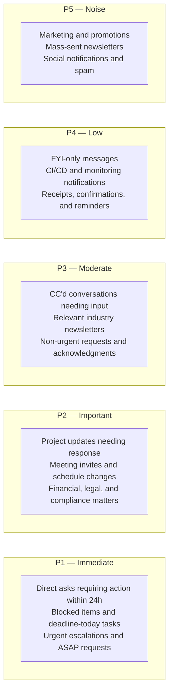

# MailPilot AI — Intelligent Email Agent

An AI-powered email management system that automatically syncs, classifies, and prioritizes emails from **Gmail** and **Outlook** using OpenAI GPT-4o-mini. Built with Next.js 16, React 19, Prisma, and a modern dashboard UI.

---

## Table of Contents

- [Features](#features)
- [Architecture Overview](#architecture-overview)
- [System Architecture Diagram](#system-architecture-diagram)
- [Authentication Flow](#authentication-flow)
- [Email Sync Pipeline](#email-sync-pipeline)
- [AI Classification Pipeline](#ai-classification-pipeline)
- [Agent Run Lifecycle](#agent-run-lifecycle)
- [Database Schema](#database-schema)
- [Dashboard UI Component Tree](#dashboard-ui-component-tree)
- [API Routes](#api-routes)
- [Priority Classification System](#priority-classification-system)
- [Tech Stack](#tech-stack)
- [Getting Started](#getting-started)
- [Environment Variables](#environment-variables)
- [Deployment](#deployment)
- [Project Structure](#project-structure)

---

## Features

- **Multi-Provider Email Sync** — Connect Gmail and Outlook accounts with OAuth2, incremental delta sync
- **AI-Powered Classification** — GPT-4o-mini classifies emails by priority (P1–P5), category, and action items
- **Two-Pass Confidence Check** — Low-confidence emails are re-classified with full body text
- **Smart Dashboard** — Filterable inbox with summary cards, thread chains, and split-pane detail view
- **Real-Time Agent Runs** — Trigger analysis manually or via daily cron; poll for live progress
- **Automatic Token Refresh** — OAuth tokens are refreshed transparently before expiry
- **Sender Profiles** — Track relationship intelligence, response times, and sentiment per sender
- **Production-Ready Deployment** — One-click deploy to Render with PostgreSQL and daily cron

---

## Architecture Overview



---

## System Architecture Diagram



---

## Authentication Flow



---

## Email Sync Pipeline

```mermaid
flowchart TD
    START([Start Sync]) --> FETCH_ACCOUNTS[Fetch all active<br/>EmailAccounts for user]
    FETCH_ACCOUNTS --> LOOP{For each account}

    LOOP --> CHECK_TOKEN{Token expires<br/>within 5 min?}
    CHECK_TOKEN -->|Yes| REFRESH[Refresh OAuth token<br/>via provider API]
    REFRESH --> UPDATE_TOKEN[Store new token in DB]
    UPDATE_TOKEN --> HAS_CURSOR{Has sync cursor?}
    CHECK_TOKEN -->|No| HAS_CURSOR

    HAS_CURSOR -->|Yes| INCREMENTAL[Incremental Sync]
    HAS_CURSOR -->|No| FULL[Full Sync — Last 30 days]

    subgraph Gmail["Gmail Provider"]
        INCREMENTAL --> G_HIST[history.list<br/>startHistoryId]
        FULL --> G_LIST[messages.list<br/>after:30d filter]
        G_HIST --> G_GET[messages.get<br/>format: full]
        G_LIST --> G_GET
    end

    subgraph Outlook["Outlook Provider"]
        INCREMENTAL --> O_DELTA[/messages/delta<br/>deltaLink]
        FULL --> O_FULL[/messages/delta<br/>receivedDateTime filter]
        O_DELTA --> O_PAGE[Paginate via<br/>@odata.nextLink]
        O_FULL --> O_PAGE
    end

    G_GET --> NORMALIZE[Normalize to<br/>NormalizedEmail format]
    O_PAGE --> NORMALIZE

    NORMALIZE --> UPSERT[Upsert emails to DB<br/>accountId + externalId]
    UPSERT --> UPDATE_CURSOR[Update sync cursor<br/>and lastSyncAt]
    UPDATE_CURSOR --> LOOP

    LOOP -->|All done| RESULT([Return SyncResult<br/>totalFetched, errors])
```

---

## AI Classification Pipeline



---

## Agent Run Lifecycle

This diagram shows the complete flow when a user clicks **"Analyze Now"** — from the initial API call through email sync, AI classification, status polling, and UI update.



---

## Database Schema



---

## Dashboard UI Component Tree



---

## API Routes

| Method | Endpoint | Description |
|--------|----------|-------------|
| `GET/POST` | `/api/auth/[...nextauth]` | NextAuth OAuth handlers |
| `GET` | `/api/emails` | List emails with filters, pagination, stats |
| `GET` | `/api/emails/[id]` | Get single email with classification |
| `PATCH` | `/api/emails/[id]/classify` | Re-classify a single email on demand |
| `GET` | `/api/accounts` | List connected email accounts |
| `POST` | `/api/accounts/sync` | Trigger manual sync for all accounts |
| `POST` | `/api/agent/run` | Start manual agent analysis run |
| `GET` | `/api/agent/run` | List last 10 agent runs |
| `GET` | `/api/agent/runs/[id]` | Get specific run status (polled by UI) |
| `POST` | `/api/agent/cron` | Cron-triggered daily analysis (CRON_SECRET auth) |

### Email List Query Parameters

| Param | Type | Description |
|-------|------|-------------|
| `cursor` | string | Pagination cursor (email ID) |
| `limit` | number | Results per page (1–100, default 50) |
| `priority` | number | Filter by priority level (1–5) |
| `category` | string | Filter by category |
| `accountId` | string | Filter by email account |
| `dateFrom` | ISO string | Emails received after this date |
| `dateTo` | ISO string | Emails received before this date |
| `search` | string | Search subject and sender |
| `actionableOnly` | boolean | Only needsReply or needsApproval |
| `threadId` | string | Get emails in a specific thread |
| `includeStats` | boolean | Include dashboard stat counts |

---

## Priority Classification System



### Email Categories

| Category | Description |
|----------|-------------|
| `approval` | Requires authorization or sign-off |
| `reply-needed` | Needs a written response |
| `meeting` | Calendar invites, meeting changes |
| `fyi` | Informational, no action needed |
| `newsletter` | Subscribed content, industry news |
| `notification` | Automated system alerts |
| `spam` | Unwanted or phishing emails |
| `personal` | Personal correspondence |

---

## Tech Stack

| Layer | Technology |
|-------|-----------|
| **Framework** | Next.js 16 (App Router) |
| **Frontend** | React 19, Tailwind CSS v4, shadcn/ui |
| **State Management** | TanStack React Query, Zustand |
| **Authentication** | NextAuth v5 (JWT), Google OAuth, Microsoft Entra ID |
| **Database** | PostgreSQL 16, Prisma ORM |
| **AI Engine** | OpenAI GPT-4o-mini |
| **Email Providers** | Google Gmail API (`googleapis`), Microsoft Graph API |
| **Deployment** | Render (Web Service + Cron Job + PostgreSQL) |

---

## Getting Started

### Prerequisites

- Node.js 20+
- PostgreSQL 16+
- Google Cloud Console project with Gmail API enabled
- Azure AD app registration with Mail permissions
- OpenAI API key

### Installation

```bash
# Clone the repository
git clone https://github.com/viditkbhatnagar/Email-Agent.git
cd Email-Agent

# Install dependencies
npm install

# Set up environment variables
cp .env.example .env
# Edit .env with your credentials

# Generate Prisma client and run migrations
npx prisma generate
npx prisma migrate dev

# Start development server
npm run dev
```

The app will be available at `http://localhost:3000`.

---

## Environment Variables

| Variable | Description |
|----------|-------------|
| `DATABASE_URL` | PostgreSQL connection string |
| `NEXTAUTH_SECRET` | Random secret for JWT signing |
| `NEXTAUTH_URL` | Application URL (`http://localhost:3000` for dev) |
| `GOOGLE_CLIENT_ID` | Google OAuth client ID |
| `GOOGLE_CLIENT_SECRET` | Google OAuth client secret |
| `AZURE_CLIENT_ID` | Microsoft Azure AD client ID |
| `AZURE_CLIENT_SECRET` | Microsoft Azure AD client secret |
| `OPENAI_API_KEY` | OpenAI API key for GPT-4o-mini |
| `CRON_SECRET` | Secret for authenticating cron job requests |

### OAuth Setup

**Google (Gmail):**
1. Go to [Google Cloud Console](https://console.cloud.google.com/)
2. Create a project and enable the Gmail API
3. Configure OAuth consent screen with scopes: `gmail.readonly`, `gmail.send`
4. Create OAuth 2.0 credentials (Web Application type)
5. Add redirect URI: `http://localhost:3000/api/auth/callback/google`

**Microsoft (Outlook):**
1. Go to [Azure Portal](https://portal.azure.com/) > App Registrations
2. Register a new application
3. Add API permissions: `Mail.Read`, `Mail.Send`, `offline_access`
4. Create a client secret
5. Add redirect URI: `http://localhost:3000/api/auth/callback/microsoft-entra-id`

---

## Deployment

### Render (Recommended)

The project includes a [`render.yaml`](render.yaml) Blueprint for one-click deployment:

```
Provisions:
  1. Web Service    — Next.js app (Starter plan)
  2. PostgreSQL 16  — Database (Starter plan)
  3. Cron Job       — Daily analysis at 8 AM UTC
```

**Steps:**
1. Push code to GitHub
2. Go to [Render Dashboard](https://dashboard.render.com/)
3. Click **New > Blueprint** and connect your repository
4. Render reads `render.yaml` and provisions all services
5. Set environment variables in the Render dashboard
6. Deploy

### Post-Deploy Commands (automatic via render.yaml)

```bash
npm install
npx prisma generate
npx prisma migrate deploy
npm run build
```

---

## Project Structure

```
Email-Agent/
├── prisma/
│   └── schema.prisma              # Database schema and models
├── src/
│   ├── app/
│   │   ├── (auth)/                # Public authentication routes
│   │   │   └── login/page.tsx     # OAuth sign-in page
│   │   ├── (dashboard)/           # Protected dashboard routes
│   │   │   ├── page.tsx           # Inbox page (main view)
│   │   │   └── settings/page.tsx  # Account settings
│   │   ├── api/
│   │   │   ├── auth/              # NextAuth OAuth handlers
│   │   │   ├── emails/            # Email CRUD + re-classify
│   │   │   ├── accounts/          # Account management + sync trigger
│   │   │   └── agent/             # Pipeline run + cron + status polling
│   │   ├── providers/             # SessionProvider, QueryClient, Toaster
│   │   ├── globals.css            # Tailwind CSS + custom styles
│   │   └── layout.tsx             # Root layout
│   ├── components/
│   │   ├── ui/                    # shadcn/ui primitives (button, card, etc.)
│   │   ├── email-list.tsx         # Virtualized email list
│   │   ├── email-detail.tsx       # Split-pane email detail view
│   │   ├── filter-bar.tsx         # Search + category + priority filters
│   │   ├── header.tsx             # Top bar with Analyze Now + user menu
│   │   ├── sidebar.tsx            # Navigation sidebar
│   │   ├── summary-cards.tsx      # Dashboard stat cards
│   │   └── thread-chain.tsx       # Email thread visualization
│   ├── hooks/
│   │   ├── use-emails.ts          # Email data fetching hooks
│   │   └── use-agent.ts           # Agent run management hooks
│   ├── lib/
│   │   ├── agent-pipeline.ts      # Main orchestration (sync + classify)
│   │   ├── classifier.ts          # OpenAI GPT-4o-mini classification
│   │   ├── email-sync.ts          # Multi-provider sync orchestration
│   │   ├── gmail.ts               # Gmail API integration
│   │   ├── outlook.ts             # Microsoft Graph API integration
│   │   ├── auth.ts                # NextAuth configuration + providers
│   │   ├── prisma.ts              # Prisma client singleton
│   │   └── utils.ts               # Utility functions (cn, etc.)
│   ├── middleware.ts               # Route protection + cron auth
│   └── types/
│       ├── index.ts               # Core type definitions
│       └── next-auth.d.ts         # NextAuth session type extensions
├── render.yaml                    # Render deployment blueprint
├── .env.example                   # Environment variable template
├── components.json                # shadcn/ui configuration
└── package.json                   # Dependencies and scripts
```

---

## License

This project is private and not licensed for public use.
